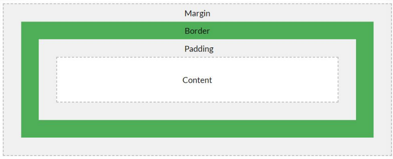

**강의 2-8 ~ 15 듣기 / css 끝**  
**실습 - 갤러리 페이지 만들기**  
**실습 - 뉴스 기사 페이지 만들기**  
**강의 3-1 ~ 4 듣기**  
**실습 - 사칙연산과 변수 다루기**  

**CSS Selector** 
: 내부/외부 스타일 시트에서 문서의 html 요소를 선택할 수 있게 하는 문법  
- ***tag*** 선택자 : html 문서의 모든 특정 태그를 선택할 때 사용
    - html 태그의 이름으로 바로 선택
    - 모든 문서 내 태그에 적용
- ***id*** 선택자 : html 문서의 하나의 요소를 특정해서 선택할 때 사용
    - html 태그의 속성으로 id를 지정/선언 가능
    - 하나의 **id는 문서 내에 하나만 존재**해야 한다
    - **#** 기호로 표현
- ***class*** 선택자 : html 문서의 여러 요소를 그룹으로 선택할 때 사용
    - html 태그의 속성으로 class 지정 가
    - 하나의 class는 문서 내 여러 개 지정 가능
    - **.** 기호로 표현
- **조합** 선택자 : 특정 요소 하위에 있는 요소를 선택할 때 사용
    - 자식 조합 선택자 : > 기호 사용
    - 자손 조합 선택자 : **띄어쓰기** 사용
- **상태** 선택자 : **콜론( : )** 기호를 사용하며 요소가 특정 상태가 되었을 때만 선택된다
    - 반응 선택자 : ***hover***, ***active***, ***visitied***
    - 상태 선택자 : ***focus***, ***enabled***, ***disable***
- **특성** 선택자 : **대괄호([ ])**를 사용하며 요소에 부여된 특성의 존재 여부나 값에 따라 선택된다
    - a [ href] : href 속성이 지정된 요소
    - a [ href=https://ww.infern.com]  : href 속성이 인프런 사이트 주소인 경우의 요소

  

**여백 관련 속성** 
 
- Margin / Padding: 40px  → 상하좌우 여백 지정
- Margin / Padding: 20px 40px  → 상하, 좌우 여백 지정
- Margin / Padding: 15px 5px 15px 5px  → 상, 우, 하, 좌 여백 지정 (시계방향)
- margin: {특정숫자} auto;  → 좌우 여백은 알아서 적용
  

**배경 속성** 
- background-color : 배경 색
- background-image : 배경 이미지
- background-repeat : 배경 이미지 반복 여부
- background-position : 배경 이미지 위치
  

**요소들의 위치 규칙** 
- **display** : 해당 요소가 어떻게 보여질지 (***block***, ***inline-block***, ***inline*** 등
    - ***none*** 속성 : 요소가 화면에 보이지 않도록
    - ***block*** 속성 : 블록 요소 형태로 표현, 내용과 관계없이 너비를 전부 차지함
    - ***inline*** 속성 : 인라인 요소 형태로 표현, 내용에 따라 너비가 결정됨
    - ***inline-block*** 속성 : 블록 요소로 표현하되, 양 옆에 다른 요소가 위치할 수 있음
    - ***flex*** : flex 레이아웃 사용 가능
    - ***grid*** : grid 레이아웃 사용 가능
- **float** : 화면 내용들을 무시하고 ***left*** 또는 ***right***으로 위치를 조정
    - ***left*** : 왼쪽으로 우선 정렬
    - ***right*** : 오른쪽으로 우선 정렬
- **position** : left, top, right, bottom 속성과 같이 사용해서 특정 요소의 위치를 직접 지정
    - ***absolute*** : 문서 내 절대 좌표로 요소를 위치시킨다 (ex. left: 10px; top: 0px;) ******
    - ***relative*** : 바로 앞의 요소에 대해 얼마나 떨어져 있을 지 지정
    - ***fixed*** : 화면 스크롤과 관계 없이 위치
    - static (기본 값) : 아무 것도 지정하지 않는 것
  

**테두리 속성 border**  
: 특정 요소에 테두리를 지정한다 
- ***border-width*** : 굵기
- ***border-style*** : 선 종류
    - solid - 실선
    - dotted - 점선
    - dashed - 대시선
    - double - 이중선
- ***border-color*** : 선 색
- border : 위 3가지 속성을 한번에 사용 가능
    - border: 1px solid #000000;
- ***border-radius*** : 테두리 둥글기
    - border-radius: 25px;  → 25px만큼 상하좌우 테두리를 둥글게
    - border-radius: 25px 5px;  → 좌상단, 우하단 25px 우상단, 좌하단 5px
    - border-radius: 15px 30px 50px;  → 좌상단 15px 우상단, 좌하단 30px, 우하단 50px
    - border-radius: 15px 30px 30px 20px;  → 좌상단, 우상단, 우하단, 좌하단