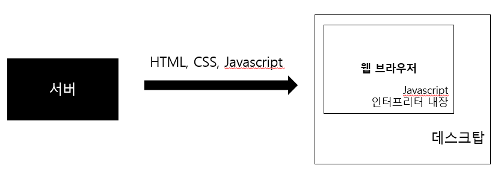

**강의 3-1 ~ 7 듣기** 
**실습 - 사칙연산과 변수 다루기** 
**퀴즈 게임 만들기** 
 

**JavaScript** 
: 객체 기반의 스크립트 언어로, 웹 문서에서 사용자와 다양한 상호작용을 하기 위해 만들었다. 
- Node.js를 통해 다양한 프로그래밍에 응용되고 있다 
 
웹 브라우저 접속 → 서버로 요청 전달 → 알맞은 code → code 해석 후 보여줌(표현) 
js에는 logic이 있음(⇒프로그래밍 언어(html과 css는 로직이 없음)) 
 

**자료형(Data type)** 
- **원시(Primitive) 형태** : Number, String, Boolean, undefined
    - ***Number*** : 숫자형
        - 정수나 실수를 포함
    - ***String*** : 문자열형
        - 문자들의 나열
    - **Boolean** : 참/거짓을 나타내는 자료형
    - ***undefined*** : 값이 정해지지 않았다는 것을 표현하는 자료형
    - ***null***
        - 아무것도 없음을 표현
        - 값이기도 하다
- **객체(Object) 형태** : Date, Array, Object
    - ***Object*** : 여러 속성이나 값, 로직들을 여러 property로 묶은 것
        - ***Property*** : 객체의 구성 멤버, Key-Value 형태의 한 쌍으로 구성
        - ***Method*** : 객체 프로퍼티의 Value로 함수가 정의된 형태
  

**Literal 선언** 
: 코드 상에서 값을 직접 명시해서 선언하거나 할당하는 것
- “1000” ⇒ 문자열    1000 ⇒ 숫자 
 

**변수(Variable)** 
- 선언 방법 : variable의 약어인 키워드 ‘***var***’뒤에 변수의 이름 선언
    - 리터럴 선언으로 대입 가능
    - 선언과 동시에 대입 가능
  

**비교 연산자** 
: 두 값을 비교하기 위해 사용되며 결과 값은 참/거짓이다  
- **==** : 동등 : 같다
- **!=** : 부등 : 다르다
- **===** : 일치 : ***데이터 타입까지** 같다*
- ***>*** , ***>=*** , ***<*** , **<=**
  

**논리 연산자** 
: 참 또는 거짓을 연산할 때 사용되며 비교문을 조합해 복잡한 조건문을 만든다 
- **&&** : and
- **||** : or
- **!** : not
  

**기타 연산자** 
- **?** : 삼항 연산자
- **delete**, **typeof** : 단항 연산자
- **&** , **|** , **^** , **~** , **<<** , **>>** , **>>>** : 비트 연산자
  

**조건문**
1. **if 문**  
    if (조건식) { 
        실행 코드 
    } 
    else if (다른 조건식) { 
        실행 코드 
    } 
    else { 
        실행 코드 
    }
2. **switch 문**  
    switch (표현식) { 
        case 값 1: 
            표현식 == 값 1일때의 실행 코드 
            break; 
        case 값 2: 
            표현식 == 값 2일때의 실행 코드 
            break; 
        default: 
            모든 조건에 속하지 않은 때 실행 코 
    }