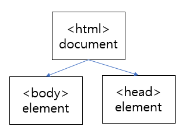

**강의 3-13 ~ 23 듣기 / JS 강의** <br>
**실습 - 회원가입 폼 검증하기** <br>
<br>

**함수(Function)**<br>
: 독립적인 실행 코드를 하나로 묶어 둔 것
- 함수를 **정의(declaration)**하고 **호출(call)**할 수 있다<br>
function 함수명(매개변수) {<br>
    실행 코드<br>
}<br>
<br>

**{  } (중괄호) ⇒ block (블록)**<br>
: 코드는 중괄호로 묶을 수 있고, 묶인 코들를 코드 블록이라고 한다<br>
함수 블록과 조건문/반복문 등의 블록은 다른 성질의 블록.<br>
⇒ 함수 블록 내에 선언된 변수는 함수 밖에서 사용할 수 없다<br>
<br>

**스코프 (Scope)**<br>
: 변수를 선언할 때 그 변수를 어디서 접근 가능한지를 정의하는 영역
- **전역(Global) 스코프** : 블록 바깥에 그냥 선언된 변수
- **지역(Local) 스코프** : 블록 내부에 선언된 변수
    - **블록 스코프** : 일반적인 블록(*조건문, 반복문 등*)에 선언된 변수
    - **함수 스코프** : *함수 내부*에 선언된 변수
<br>

**스코프 범위**<br>
- 전역 스코프에 선언된 변수<br>
    ⇒ ***모든 스코프***에서 사용 가능<br>
- 블록 스코프에 선언된 변수<br>
    ⇒ ***var***로 선언 : ***모든 스코프***에서 사용 가능
    ⇒ ***let***로 선언 : 선언된 블록 또는 중첩된 ***블록 내에서만*** 사용 가능
- 함수 스코프에 선언된 변수<br>
    ⇒ 해당 ***함수 내에서만*** 사용 가능
<br> <br> 

**DOM (Document Object Model)**<br>
: 프로그래밍 언어에서 ***HTML 문서의 정보들을 다룰 수 있***게 해주는 ***프로그래밍 인터페이스***<br>
<br>
- html로 작성된 화면 요소들을 웹 브라우저가 해석하고 프로그래밍 가능한 인터페이스로 제공하는 객체 모델
- html 태그로 작성된 요소들은 DOM Object로 표현된다
- 모든 요소들은 ***속성***, ***이벤트***, ***프로퍼티***의 구성을 가진다
- html 코드는 DOM 형태로 해석되어 ***CSS의 적용***, ***JS와의 상호작용*** 등이 이루어진다
- DOM은 ***html 파일의 구조를 계층적으로 정리***한다<br>
    <br>
<br><br>    

**DOM의 주요 객체**<br>
- **document** : html 문서의 최상위 root 객체
    - html 문서 전체를 대변한다
- **element** : html document 하위의 화면 요소(html tag로 그려지는)들
    - 계층적인 형태로 존재한다
        <br>
<br><br>       

**DOM 접근 함수**
- **document.getElementById(elementId)** : 요소의 id 값으로 요소를 가져온다
- **document.getElementByTagName(name)** : 요소의 태그 종류로 요소들 가져온다
- **document.getElementsByClassName(className)** :  요소의 class 값으로 요소들을 가져온다
<br>

**QuerySelector**<br>
**document.querySellector(selector)** : 선택자 문법, **문서 내의 요소들을 가져온다**<br>
var elements = document.querySelector(”div.panels li”);<br>
→ 클래스가 panels인 div 내의 li 요소들을 가져온다<br>
<br>

**DOM 객체 추가**<br>
: DOM 객체를 추가해서 DOM 구조에 추가하면 화면에 표시된다<br>
- **document.createElement(tagName)** : 새로운 DOM 노드 객체 생성
- **(특정 element).appendChild(삽입할 DOM 노드 객체)** : 특정 DOM 객체 하위에 다른 DOM 객체를 삽입
```jsx
var div = document.getElementById("panels");
var element = document.creatElement('p');
element.innerHTML = 'p 태그의 내용입니다.';
div.appendChild(element);
```
<br>

**DOM 객체 수정**<br>
: DOM 접근 API를 사용해 필요한 객체를 가져와서 ***innerHTML***이나 ***style 속성***으로 객체를 수정한다<br>
- **element.innerHTML** : 요소 내부의 콘텐츠 값에 접근하거나 지정
- **element.style** : 요소가 가지고 있는 style을 지정
    - ex) element.style.display = ‘none’  //display 속성을 none으로 변경
    - ex) element.style.fontsize = ‘11pt’
- **element.remove()** : 자기 자신을 지운다
<br><br>

**이벤트(Event)**<br>
: DOM 기반의 요소들은 이벤트를 감지해서, 이벤트가 감지되었을 때 원하는 코드가 실행되도록 할 수 있다<br>
- ***click*** event : 해당 객체를 클릭했을 때 발생
- ***mousemove*** event : 해당 객체 위에서 마우스를 이동했을 때 발생
- ***keypress*** event : 해당 객체가 선택된 상태에서 키보드 입력이 있을 때 발생
- ***submit*** event : form의 전송 버튼이 눌렸을 때 발생
- ***load*** event : 해당 객체가 화면에 로딩이 완료되어 화면에 표시될 때 발생
<br><br>

**이벤트 리스너 등록**<br>
```jsx
//등록 시에 익명함수로 바로 선언하는 방법
var element = document.getElementById("panels");
element.addEventListener('click', function() {
	alert("안녕!");
});

//이미 선언된 함수를 사용하는 방법
element.addEventListener('click', preFunc);
```
<br>

**익명함수 / 콜백함수**<br>
- **익명함수** : 이름을 정하지 않고 함수블록만 정의해서 사용하는 함수
- **콜백함수** : 이벤트 리스너와 같이 특정 트리거가 발생했을 때, 완료시점에 호출받기 위한 함수(매개변수로 전달하는 함수)
<br><br>

**클로져 (Closure)**<br>
: 내부함수가 실행시점을 포함해서 외부함수의 맥락에 접근할 수 있는 것<br>
즉, 어떤 함수를 정의할 때 ***외부 스코프에 정의된 변수들까지 캡쳐***해서, 함수가 실행될 때 사용할 수 있도록 한다
- ***정보은닉***과 ***캡슐화***를 제공한다
```jsx
function createTodayExchangeRate(wonPerDollar) {
	return(function (dollar) {
		var result = dollar * wonPerDollar;
		console.log(result);
		return result;
	}
}

var convertExchange = createTodayExchangeRate(1200);
/* 새로운 내부 함수가 생성되면서 1200 변수가 캡쳐되어 같이 저장됨
   => 환율 기준값이 캡슐화됨!
*/

convertExchange(20); //1200원 기준으로 20달러 변환
```
<br>

**AJAX(Asynchronous Javascript And Xml)**<br>
: 자바스크립트에 내장된 XMLHttpRequest 객체를 이용해서 **페이지를 새로고침하지 않고도 필요한 데이터**(백엔드 데이터)**를 비동기적으로 불러오는** 기법<br>
이때, 주고 받는 데이터 형식으로 XML을 사용했는데 현재는 ***JSON***을 사용한다<br>
<br>
→ 데이터가 변경되었을 때 페이지 전체가 렌더링 되는 것이 아닌 부분적으로 렌더링 됨<br>
```jsx
var httpRequest = new XMLHttpRequest();
httpRequest.onreadystatechange = function() {
	//readyStatus :  1, 2, 3, 4 (4가 완료)
	//status : 400번대(client 오류) 200번대(정상) 500번대(sever 오류)
	if(this.readyStatus == 4 && tins.status == 200) {
		//응답 문자열을 innerHTML에
		document.getElementById("panels").innerHTML = this.responseText;
	}
}
httpRequest.open("Get", "/getJson", true); //요청방식 정하기
httpRequest.send();  //전송을 보낸다
```
<br>

**JSON (JavaScript Object Notation)**<br>
: 자바스크립트 객체를 표현하는 데이터 형식. 객체 타입의 리터럴 선언과 비슷<br>
```jsx
{
	"name" : "인프런",
	"born" : 2017,
	"classes" : [
		...
	]
}
```