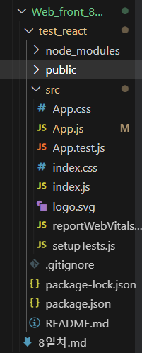

**실습 - 인스타그램 포스팅 카드 만들기** <br>
**React 공부하기** <br>
<br>

Web-app을 쉽게 만들 수 있는 라이브러리 ⇒ **React** !<br>
**Web-app의 장점**
1. 모바일앱으로 발행이 쉬움
2. 앱처럼 뛰어난 UX
3. 일반 웹사이트보다 비즈니스적 강점 존재
<br><br>

**vs code에서 React 파일 생성 법**<br>
**npx** create-react-app  프로젝트명<br>
<br>

**npm(Node Package Manager)**<br>
- 오픈 소스 JavaScript 모듈을 검색, 설치, 업데이트 및 관리하는 데 사용
- 프로젝트에 필요한 다양한 패키지(라이브러리, 프레임워크)를 설치 가능
- 패키지는 ‘package.json’ 파일에 명시된 종속성(dependency)으로 관리된다
- ‘npm install 패키지명’ 명령어를 사용해 패키지를 설치할 수 있다
- **npm start** : 내가 짠 코드 미리보기 (html의 라이브 서버 같은 ..<br>
⇒ 이 npm 툴을 사용하기 위해서 node.js를 다운 받아야 하는 것!
<br><br>

**npx (Node Package Execute)**
- npm 5.2.0버전 이상에서 제공되는 도구
- 로컬에 설치된 패키지를 간편하게 실행할 수 있도록 도와준다
- ‘npx 패키지명’ 명령어를 사용해 로컬에 설치되지 않은 패키지를 실행할 수 있다
- npx create-react-app는 create-react-app 패키지를 즉시 다운로드해서 즉시 프로젝트를 생성<br>
<br>
<br>

**App.js** : 메인페이지에 들어갈 html 코드를 짜는 곳<br>
어떻게 이렇게 되냐! ⇒ index.js 파일이 App.js에 있는 html코드를 index.html 파일에서 불러라 하고 알려줌. 그래서 실제로 렌더링 되는 파일은 index.html이지만 app.js에 있는 html 코드들이 보이는 것 
**node_module**s : 라이브러리를 모든 폴더<br>
**public** : static 파일을 보관하는 폴더<br>
**src** : 소스코드를 보관하는 폴더<br>
**package.json** : 설치한 라이브러리의 목록들<br>
<br>

**React에서 html ⇒ JSX 문법**<br>
1. class=""가 아니라 ***className=""*** 으로 클래스명을 지정해야 한다
    > < div className="App">
2. ***{}*** 기호를 이용해서 주변의 자바스크립트 변수와 같은 것을 태그 중간중간 집어넣을 수 있다<br>
    ⇒ 데이터 바인딩 하는 방법
    > < h4> {posts} </ h4>
2. ***{}*** 기호를 이용해서 주변의 자바스크립트 변수와 같은 것을 태그 중간중간 집어넣을 수 있다<br>
3. 스타일을 넣고 싶으면 ***style={ 오브젝트 자료형으로 만든 스타일 }***을 넣어야 한다
    > < div style={ { color : 'white', fontSize : '30px' }}>개발 Blog</ div>

<br>
리액트를 사용하는 가장 큰 이유 : 데이터 바인딩이 쉽다

***데이터 바인딩*** : 서버에서 가져온 데이터를 웹에 보이는 것. 즉, html에 넣는 것<br>
src, id, href 등의 ***속성에도 {변수명, 함수 등}*** 을 넣을 수 있음<br>
<br>

**State 문법**<br>
데이터는 변수에 넣거나 state에 넣는다. state는 **리액트의 데이터 저장공간**이다<br>
> import React, { useState } from 'react'; <br>
useState("여자 코트 추천");<br><br>
→ [a, b] 형식의 array가 생기는데, a에는 “여자 코트 추천”이 들어가고, b는 state를 정정해주는(변경하는) 함수가 생긴다<br>
> 

*let [a, b] = useState("여자 코트 추천");*  ⇒ *ES6 destructuring 문법* <br>
⇒ array, object에 있던 자료를 변수에 쉽게 담고 싶을 때 사용 <br>
**사용 이유 : 웹이 app처럼 동작하게 만들고 싶어서** <br>
- state는 변경되면 ***html이 자동으로 재렌더링*** 된다 (새로고침 없이 되니까 빠르고 자연스러움<br>
<br>
따라서 자주 바뀌고 중요한 데이터를 state로 저장해서 쓰면 좋다! <br>
state는 바로 변경이 불가능하고 ***변경을 할 수 있는 함수(b)로 변경***해야 한다<br>

> <span onClick={ ()=>{ 좋아요변경(좋아요+1) } }>👍</span> { 좋아요 }

변경할 때 deep copy가 가장 좋은 방법! **deep copy**는 값 공유가 일어나지 않고 새로운 copy본이 생김<br>
<br>

**Component**<br>
길어지는 html 코드를 줄일 수 있음<br>
**컴포넌트를 만드는 방법**
1. function 만들기
2. return() 안에 html 넣기
3. <함수명><함수명/> 쓰기

```jsx
function Modal() {
  return (
    <div className="modal">
      <h4>제목</h4>
      <p>날짜</p>
      <p>상세내용</p>
    </div>
  )
}

//또는
const Modal = () => {     // 값 변경을 방지해
	<div className="modal">
	  <h4>제목</h4>
	  <p>날짜</p>
    <p>상세내용</p>
  </div>
}
```

의미없는 < div>대신 **<></>** 사용 가능<br>
**어떤 걸 컴포넌트로 만들어야 할까?**
1. 반복적인 html 코드를 축약할 때
2. 큰 페이지들 
3. 자주 변경되는 것들

단점 : state를 가져다 쓸 때 문제가 생긴다