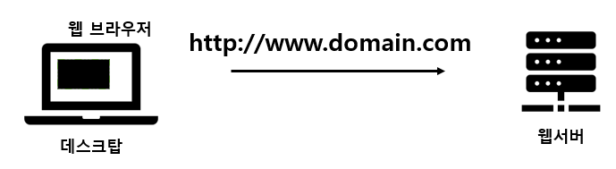

**Web (World Wide Web)**  
: 인터넷 망으로 연결된 사용자 또는 컴퓨터들이 정보를 공유할 수 있는 네트워크 
  

**하이퍼미디어 (Hyper Media)** 
: 멀티미디어 데이터와 다른 데이터를 연관 시켜서, 연관된 데이터를 탐색할 수 있도록 한 것 
- 텍스트에 링크가 걸려있다 → 하이퍼텍스트 
- 이미지에 링크가 걸려있다 → 하이퍼미디어  

 **웹의 구조**  
 
데스크탑 - client    웹서버 - server 
client가 요청을 보내면 server가 응답하는 방식  

 **URL의 구조**  
- **프로토콜** : http와 같은 자원 간 통신 방식을 정의함
- **IP** : 특정 네트워크 시스템의 위치
- **도메인** : IP를 대신하 사용자 친화적인 시스템의 주소. 즉 가상의 주소 
    사용자는 도메인을 통해 검색하며, 컴퓨터는 도메인을 ip로 변환하고 요청을 보낸다 
    요청의 형식이 바로 프로토콜 
**http<hi>://ww.domain.com/path** 
→ http 방식의 프로토콜을 사용해 해당 도메인에 존재하는 서버에게 정보를 보낸다 
path가 의미하는 것 : 서버 안에 있는 세부 주소  

 **웹 개발의 구성** 
**front-end** : 사용자에 보여지는 외관(UI/UX)을 개발 
**back-end** : 어떤 데이터가 보여질지 정리하고 가공하는 로직을 개발 
**database** : 데이터를 저장하고 꺼낼 수 있는 공간을 구성하고 관리  

 **HTML (HyperText Markup Language)** 
: 웹을 이루는 가장 기초적인 구성 요소로, 웹 페이지의 내용을 서술하고 정의 
- “태그”라는 문법적 특성으로 웹 화면의 요소(element)를 표현 
- 마크업 언어 
- 여는 태그와 닫는 태그의 한 쌍으로 이루어져 있으며, 태그는 중첩될 수 있다 
    > **< html> '내용' </ html>**
     

**HTML의 기본 구조** 
- html, head, body 태그 
- `html` : 문서의 시작과 끝 
- `head` : 문서의 메타 정보를 정의 
    - 메타 정보 : 사용자에게 보여지지 않는 문서에 대한 정보 
- `body` : 실제 사용자에게 보여질 화면을 구현 
개발자 도구 단축키 : **ctrl + shift + i**   

 글의 내용을 정의하는 **서식 태그들** - 글의 성격이나 구성을 위해 사용되는 태그 
- heading(주제) 태그 : h1, h2, h3, …
    - 제목을 구성할 때 사용되는 태그
    - 제목의 단계에 따라 **h1부터** **h6** 태그로 나뉜다
- paragraph(문단) 태그 : p
    - 하나의 문단을 지정할 때 사용되는 태그
    - **p** 태그로 지정된 문장은 하나의 문단으로 묶여서 화면에 보여지게 된다
- break(줄바꿈) 태그 : br
    - html 코드 상에서 줄바꿈을 해도 웹 페이지 상에서는 줄 바꿈이 안된다
    - **br** 태그를 사용해서 줄바꿈을 해야 한다
    - **홀태그**(닫는 태그가 없는)이다
- italic(기울임) 태그 : i
    - 특정 글자에 기울임체를 적용할 때 **i** 태그 사용
- strong, bold(강조) 태그 : strong, b
    - 특정 글자를 강조하고 싶을 때 **strong** 또는 **b** 태그 사용
- horizontal rule 태그 : hr
    - 문서 내에 가로 선을 넣을 때 **hr** 태그 사용
    - 홀태그이다

  리스트를 나열하는 **리스트 태그**들 - 어떠한 항목을 구분해서 나열하고 싶을 때 사용 
여러 개의 li 태그를 ol 또는 ul 태그로 묶어서 사용한다 
- Ordered list 태그 : ol
    - 순서가 있는 항목들을 나열할 때 **ol** 태그 사용
    - 순서가 표시된다
- Unordered list 태그 : ul
    - 순서가 정해지지 않은 항목들을 나열할 때 **ul** 태그 사용
    - 블릿기호가 표시된다
- List item 태그 : li
    - list의 요소들을 **li** 태그를 이용해 감싼다

 
 **vs code에서의 html 단축키** 
- alt + shift : 한 줄 복사
- ctrl + enter : 뒷내용 무시하고 엔터
- ! + tab : html 기본 틀 만들기
- tag.class + tab : 클래스명 바로 부여
- tag#id + tab : 아이디명 바로 부여
- alt + l + o : live server 열기
