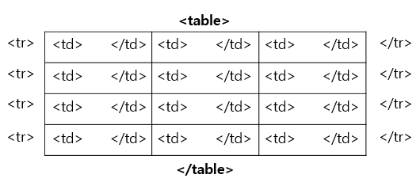

**1일차 실습 - html을 이용한 자기소개 페이지 만들기**  
  

**HTML 요소의 두 가지 형태**  
화면 영역을 차지하는 형태에 따라 나뉜다 
- **Block**
    - 태그의 내용과 관계없이 상위 요소의 너비에 맞게 너비를 차지함
    - 레이아웃 영역을 지정할 때 주로 사용됨
- **Inline**
    - 태그의 내용에 맞춰서 너비가 결정됨
    - 레이아웃에 영향을 주지 않고 일부 내용에만 스타일이나 내용의 구분을 주고 싶을 때 사용됨
  

**태그와 요소** 
- **태그(Tag)** : HTML의 문법적 규칙이자 코드
- **요소(Element)** : 실제 웹 페이지 화면에 그려지는 구성 요소 
→ 보통 하나의 HTML 태그가 웹 페이지의 요소에 일대일로 연결된다
  

**Block 요소** 
: 화면의 레이아웃을 짜거나 구성을 나눌 때 사용한다. block 요소에 CSS 스타일을 적용해 화면의 레이아웃을 완성한다 
- `**div**` : block 요소의 대표적인 태그로 *아무 의미를 담지 않는다*. 아래 요소들의 상위 개념
- `**section**` : *서로 다른 내용 구성*이 들어갈 영역을 구분하는 블록 요소
- `**article**` : *동일한 내용 구성이 반복*될 때 구분하기 위한 블록 요소
- `**header**` : 본문 내용의 *머리말 영역*을 구성하기 위한 블록 요소
- `**footer**` : 본문 내용의 *바닥글 영역*을 구성하기 위한 블록 요소 
 
 

**Inline 요소** 
: 화면의 레이아웃에 영향을 미치지 않고 특정 내용을 강조하거나 구분할 때 사용한다.  
- `**span**` : 아무 의미도 내포하지 않은 대표적은 inline 요소
- `**b**`  ,  `**i`**  , `**strong`**  …
  

**Block/Inline 요소의 사용** 
- section, header 등의 레이아웃 구성을 위한 태그들은 전부 div로 대체해서 사용이 가능하지만, 스크린리더, 검색 엔진 등과 같은 Accessibility를 고려해서 **의미를 내포하는 태그를 사용**하는 것이 중요!
- CSS의 스타일 중 display 속성을 이용하면 div 등의 기존 block 요소를 위한 태그도 inline 요소로 바꿔서 보여지게 할 수 있고, span 등의 inline 요소도 block 요소로  표현하는 것도 가능 → 하지만, 가능하면 기본 형태에 맞도록 사용하기 (why? Accessibility를 위해!) 
  

**하이퍼미디어** 
: 웹 페이지 내의 미디어를 통해 다른 연관 정보로 넘어갈 수 있게 하는 연결고리. 
즉, **링크**를 의미한다. 
  

**하이퍼미디어 태그** 
- a(anchor) 태그 : 특정 내용에 링크를 생성할 때 사용
    - href 속성으로 이동할 리소스를 지정한다
    - 이동할 리소스는 URL과 같은 웹 페이지 주소나 미디어의 주소가 된다 
    **<a href = “이동할 url”> “웹에 보여질 글씨” </a>**
    
- img(image) 태그 : 이미디를 삽입할 때 사용
    - src 속성으로 이미지의 주소를 지정하면 해당 이미지가 표시된다
    - 홀태그 형식이다 
    ****
    
- embed 태그
    - 외부 콘텐츠를 삽입할 때 사용
    - 유튜브, 플래스와 같은 외부 미디어 객체를 웹 사이트에 포함시킬 때 사용한다
    - 비슷한 태그로 object 태그가 있다 
    **<embed src=”객체의 주소”/>**
  

**표 관련 태그** 
- **table** : 표의 시작과 끝
- **tr** : 표 하나의 행
- **th**, **td** : 표 하나의 열
    - th는 table heading이기 때문에 제목 칸으로, bold 처리 된다 
 
- **rowspan** : 합칠 행의 수 
    <td rowspan = “2”> </td>  →  즉, 세로로 2칸이 합쳐짐
    
- **colspan** : 합칠 열의 수 
    <td colspan = “2”> </td>  →  즉, 가로로 2칸이 합쳐짐