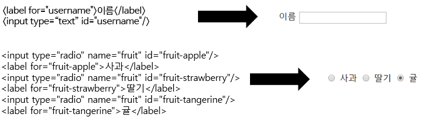
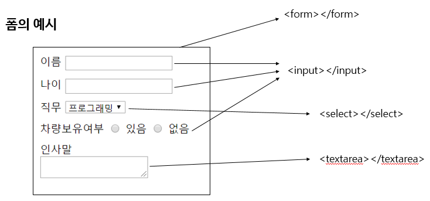
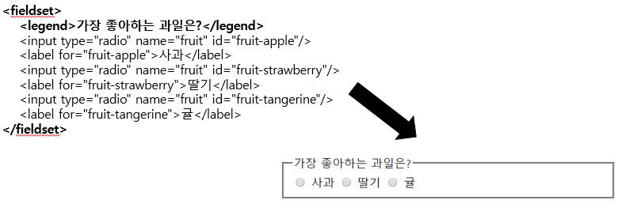

**실습 - 여행 계획 페이지 만들기**  
**강의 Chapter 8, 9, 10, 11, 12, 13, 14 듣기 → html 끝!**  
**실습 - 회원가입 폼 만들기**  
 

**폼(Form)** 
: 사용자에게 데이터를 입력 받기 위한 화면 구성. < form> < /form> 사이에 폼 관련 태그들을 넣어서 하나의 폼을 구성한다 
- `form` : 폼의 시작과 끝을 정의하는 태그이다. 태그 내에 input, select, button등의 입력 태그들을 넣어 사용자의 입력을 받아 원하는 서버의 주소로 데이터를 전송할 수 있다
    - **action** 속성 : 데이터를 전송할 url 주소
    - **method** 속성 : 데이터를 전송할 방법. 주로 get과 post의 방식 중 하나를 사용한다
        - *get*은 검색창이라고 생각 (url에 입력 값이 보임
        - *post*는 데이터를 보이지 않는 방식으로 전달 (url에 입력 값이 보이지 않음
    - **enctype** 속성 : 데이터를 전송할 때 전송 인코딩 형식을 지정
    - table 태그랑 비슷하다고 생각하면 될 듯
- `input` : 사용자 입력을 받는 입력 상자나 버튼을 만드는 태그.
    - type의 속성에 따라 버튼을 표시할 수 있다
    - 홀 태그 형식이다
    - **type** 속성 : 입력 형태를 지정. *text, password, button, submit, radio, checkbox* 등이 있다
        - *text* : 텍스트를 입력할 수 있는 상자
        - *password* : 입력 값이 마스킹된다
        - *button* : value로 버튼에 어떤 값이 표시될지 표현해주어야 한다
        - *submit* : 버튼을 눌렀을 때 데이터가 바로 전송되어 페이지가 이동한다
        - *radio* : 동태눈깔 버튼 ,., (상호 배타적
        - *checkbox* : 체크박스 버튼 (중첩 가능
    - **name** 속성 : 입력 값의 이름을 지정
    - **value** 속성 : 입력 상자의 값을 지정
        - 서버에 실제로 전달되는 값!
- `select` : 사용자 입력을 받는 입력 상자나 버튼을 만드는 태그
    - 드롭다운 선택 박스가 만들어진다
    - option 태그를 사용해서 선택지를 추가한다 
        > < option value = “서버에 전송될 값“>선택지< /option>
    - list 태그랑 비슷하다고 생각하면 될 듯
- `label` : 입력 상자마다 제목(label)을 표시할 수있다.
    - 입력 태그에 **id 속성**으로 지정된 값을 속성으로 넣어주면, 그 입력 태그를 수식해준다
    - name : 사용자 눈에 보이지는 않고, 서버가 보기 위한 이름표. 전송되는 data 수식.  
         
- `button` : 버튼을 만드는 태그
- `textarea` : 여러 줄을 입력 받을 수 있는 입력 태그이다
    - 쌍 태그이다
    - 태그 사이에 값을 미리 넣을 수 있다
    - 태그 내부 컨텐츠는 줄 바꿈을 인식한다
    - 내부 컨텐츠는 서버로 전송된다  
      
- `fieldset`  ,  `legend`  : 여러 입력 태그를 하나의 그룹으로 묶고 제목을 묶는 태그 
     
 

**메타 태그(Meta tag)**  
: 웹 문서의 정보(메타 데이터)를 알려주기 위해 작성하는 태그 
- 사용자에게는 보이지 않는다
- 웹 브라우저, 검색엔진, 메타 데이터를 활용하는 웹 서비스들이 사용한다
- **<head>태그 내에 위치**하고 홀 태그 형식으로 사용한다
- ***charset*** : 웹 문서의 인코딩을 알려주는 역할. 현재의 웹에서는 유니코드 기반인 UTF-8 방식을 사용한다 
    > <meta charset=”UTF-8”>
- ***viewport*** : 웹 문서가 그려지는 영역에 대해 크기, 확대 비율을 어떻게 조정할지 결정. 
    > <meta name="viewport" content="width=device-width, initial-scale=1.0">
    - 이외에도 user-scalable(확대 축소 불가능설정), maximum-scale, minimum-scale 등을 사용할 수 있다 → 모바일에서 사용
- ***author***, ***description***, ***keyword*** : 검색 엔진이나 외부 웹 서비스에 알려질 정보들을 표시
    - sns에서 자주 사용된다 
    > <meta name=”author” content=”인프런”
    > < meta /name=”keyword” /contect=”HTML”>
    > <meta name=”descrition” contect=”웹 개발 오리지널”>
- ***open graph*** : SNS에 더 자세한 정보를 알려줄 수 있다
    > <meta property=”og:type” content=”article” />
 
    
**iframe 태그** 
: 다른 웹 페이지를 표시할 수 있는 태그 
> <ifram /width=”500” height=”300” src=url frameborder=”0”> < iframe>
>
→ 500x300 크기의 박스가 생기면서 박스 내부에 웹 url을 렌더링 한다 
- ***src*** 속성 : iframe에 표시될 웹 문서 주고
- ***width*** , ***height*** : 높이, 너비 (px기준이며 %도 가능하다)
- ***frameborder*** : 테두리 표시 여부(1, 0)
- ***scrolling*** : 스크롤바 표시 여부 (yes, no, auto)
- ***name*** : a 태그에서 참조할 이름
